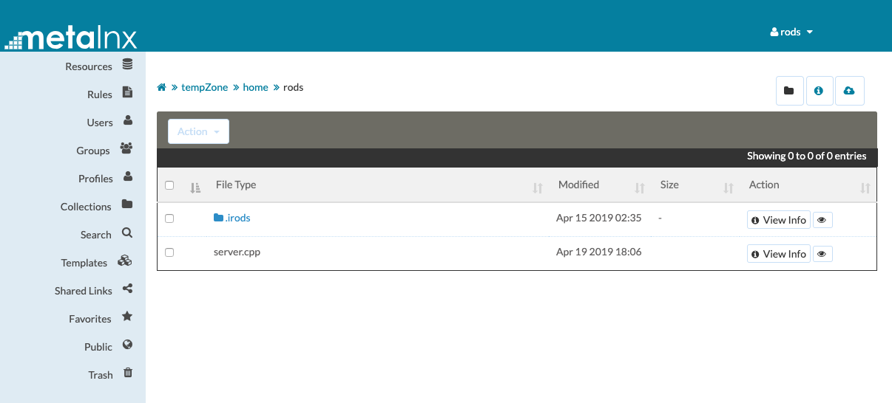

Metalnx is a web application designed to work alongside [iRODS](https://irods.org). It is a graphical user interface and serves as a client that authenticates to an existing iRODS Zone.




The preferred method of deployment is via Docker.

## Deploying Packaged Metalnx via docker-compose

docker-compose.yml
```
version: '3'

services:

  db:
    image: postgres
    restart: always
    environment:
      POSTGRES_PASSWORD: superdupersecret
      POSTGRES_USER: metalnxuser
      POSTGRES_DB: metalnxdb

  metalnx:
    image: irods/metalnx:latest
    restart: always
    volumes:
      - ./metalnx-configuration:/etc/irods-ext
    ports:
      - 80:8080
```

and then the `./metalnx-configuration/metalnx.properties` file requires rodsadmin iRODS connection credentials and points to the docker-compose database (alias db) with:
```
db.url=jdbc:postgresql://db:5432/metalnxdb
db.username=metalnxuser
db.password=superdupersecret
```

Metalnx will be available on port 80 of the docker host machine at `/metalnx`.

This configuration could be supplemented with an nginx (or other) reverse-proxy to put Metalnx port 80 (and the subpath `/metalnx`) behind https on 443.

Examples of the metalnx-configuration can be found in [docker-test-framework/etc/irods-ext](./docker-test-framework/etc/irods-ext).

## Deploying Packaged Metalnx via Docker Hub directly

### Prepare the database

First, create and configure a database for Metalnx's use (this is for caching and other local information).

```
$ (sudo) su - postgres
postgres$ psql
psql> CREATE USER metalnx WITH PASSWORD 'changeme';
psql> CREATE DATABASE "IRODS-EXT";
psql> GRANT ALL PRIVILEGES ON DATABASE "IRODS-EXT" TO metalnx;
```

### Prepare the application

[Configuration](CONFIGURATION.md) of the default application can change many things about how Metalnx looks and behaves.
 - Configuration of Zone information, and features to display
 - Theming with custom CSS/Logo

Create a copy of the default [docker-test-framework/etc/irods-ext](./docker-test-framework/etc/irods-ext) directory and update `metalnx.properties` and `metalnxConfig.xml`, and then run a container with the new configuration, probably with `--add-host` information due to Docker:
```
docker run -d \
  -p 8080:8080 \
  -v `pwd`/mylocal-irods-ext:/etc/irods-ext \
  --add-host hostcomputer:172.17.0.1 \
  --name metalnx \
  irods/metalnx:latest
```

To map a local directory with SSL certificates (self-signed or from a CA), the container will look in `/tmp/cert`:
```
 -v `pwd`/mylocal-certs:/tmp/cert \
```

The login screen should appear when requested in a web browser:

```
http://x.x.x.x:8080/metalnx
```


Or...

## Building Metalnx

From source, the package will 'just build':
```
make
```

This will result in a new Docker image named `myimages/metalnx:latest` on your machine.

## Deploying Built Metalnx

If you're deploying your own image (built just above):

```
docker run -d \
  -p 8080:8080 \
  -v `pwd`/mylocal-irods-ext:/etc/irods-ext \
  --add-host hostcomputer:172.17.0.1 \
  --name metalnx \
  myimages/metalnx:latest
```

### More information

More documentation can be found in the [Docs](docs) directory.

### Copyright and License

Copyright © 2018-2020 University of North Carolina at Chapel Hill; 2015-2017, Dell EMC.

This software is provided under the [BSD-3 License](LICENSE.md).
