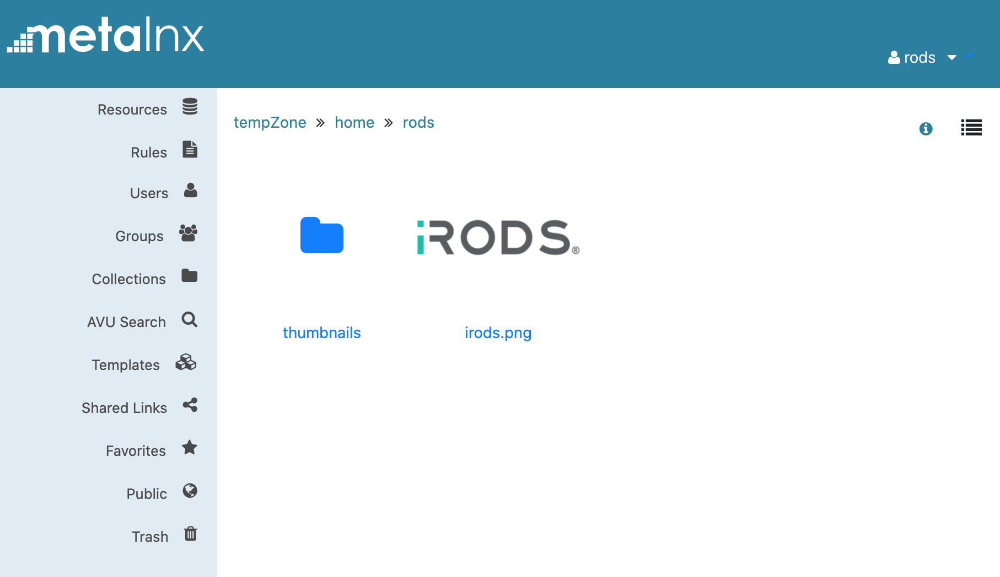

# Gallery View

Metalnx 2.4.0 shipped with an additional view for Collections.  This new view provides a thumbnail or gallery view of the data objects in the Collection and is populated by a server-side policy which provides the thumbnail information.

Metalnx asks the connected iRODS server to run a rule named:
```
irods_policy_list_thumbnails_for_logical_path(*logical_path, *offset, *limit, *out){}
```




An example iRODS rule language rule that provides fullpaths to thumbnails in a direct subcollection named `thumbnails`:

```
irods_policy_list_thumbnails_for_logical_path(*logical_path, *offset, *limit, *out){
  # trim trailing slash if present
  writeLine('serverLog', 'logical_path_before_trim=[*logical_path]');
  *lastchar = substr(*logical_path, strlen(*logical_path)-1, strlen(*logical_path));
  if ( *lastchar == '/' ) then { *logical_path = trimr(*logical_path, "/"); }
  writeLine('serverLog', 'logical_path_after_trim=[*logical_path]');
  # start json
  *thejson = '{ "location": "*logical_path", "items": [ ';
  *comma = 0;
  # subcollections
  foreach ( *row in SELECT COLL_ID, COLL_NAME, COLL_MODIFY_TIME where COLL_PARENT_NAME = '*logical_path'){
    if (*comma == 1) then {*thejson = *thejson++', '};
    *parts = split(*row.COLL_NAME, "/");
    *thecoll = elem(*parts, size(*parts)-1);
    *thejson = *thejson++'{ "id": '++*row.COLL_ID;
    *thejson = *thejson++', "name": "'++*thecoll++'"';
    *thejson = *thejson++', "collection": true';
    *thejson = *thejson++', "lastModified": "'++*row.COLL_MODIFY_TIME++'"';
    *thejson = *thejson++', "hover": "*thecoll"';
    *thejson = *thejson++' }';
    *comma = 1;
  }
  # separator
  foreach ( *row in SELECT count(DATA_ID) where COLL_NAME = '*logical_path'){
    if (*row.DATA_ID != '0' && *comma == 1) then {*thejson = *thejson++', '};
  }
  *comma = 0;
  # data objects
  foreach ( *row in SELECT DATA_ID, DATA_NAME, DATA_SIZE, DATA_MODIFY_TIME where COLL_NAME = '*logical_path'){
    if (*comma == 1) then {*thejson = *thejson++', '};
    *thejson = *thejson++'{ "id": '++*row.DATA_ID;
    *thejson = *thejson++', "name": "'++*row.DATA_NAME++'"';
    *thejson = *thejson++', "size": "'++*row.DATA_SIZE++'"';
    *thejson = *thejson++', "collection": false';
    *thejson = *thejson++', "lastModified": "'++*row.DATA_MODIFY_TIME++'"';
    *thejson = *thejson++', "hover": "'++*row.DATA_SIZE++' bytes"';
    *thejson = *thejson++', "thumbnail": "'++*logical_path++'/thumbnails/'++*row.DATA_NAME++'"';
    *thejson = *thejson++' }';
    *comma = 1;
  }
  # end json
  *thejson = *thejson++' ] }';
  writeLine('serverLog', 'thejson: '++*thejson);
  *out = *thejson;
}
```

Metalnx will use the returned JSON payload to render the thumbnails with designated name, size, last modified date, and hover text.

```
{
  "location": "/tempZone/home/rods",
  "items": [
    {
      "id": 10027,
      "name": "thumbnails",
      "collection": true,
      "lastModified": "01622853658",
      "hover": "thumbnails"
    },
    {
      "id": 10026,
      "name": "irods.png",
      "size": "224",
      "collection": false,
      "lastModified": "01621015799",
      "hover": "224 bytes",
      "thumbnail": "/tempZone/home/rods/thumbnails/irods.png"
    }
  ]
}
```
